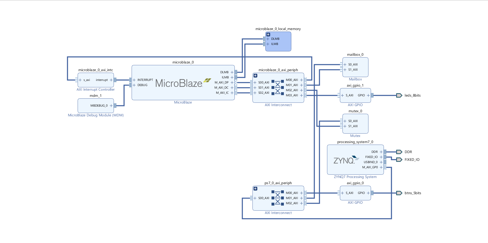

# FlashCore

***

## Single core Microblaze with Mutex and Mailbox IP cores

This experiment was conducted in order to investigate mailbox and mutex ip core usage with one core microblaze processor and one Zynq processor. There are four source files added in the experiment. Two for microblaze and two for mutex. They are designed to run two application at the same time, mailbox or mutex applications should be run seperately.

### Step-by-step Build Instructions

1. Construct the below hardware design

2. Synthesize the design and export hardware
3. Choose create new application project and choose target hardware
4. Choose processor option accordingly
5. Select proper board support package and create empty application
6. Import the given source files according to the selected processor
7. Repeat steps 3,4,5,6 for all source files
8. Right click on mutex or mailbox project and add run or debug configuration
9. Double click on system debugger and in the application tab, choose microblaze and zynq processors
10. In project name tab, choose the proper source file then click apply
11. Run/debug the project 

