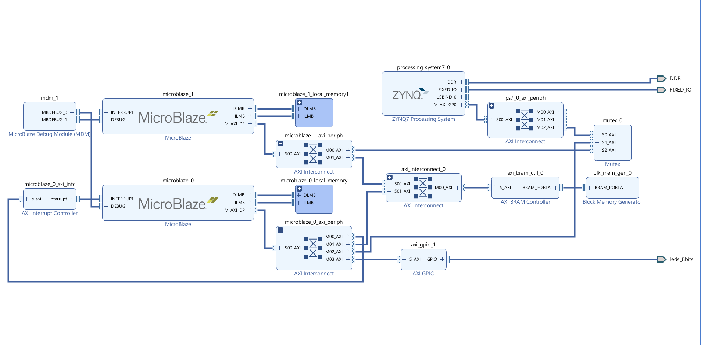

# FlashCore

***

## Multi core Microblaze with Mutex IP core

This experiments was conducted in order to investigate usage of multi microblaze processor cores. There are two source files added in the experiment under application files for each microblaze core. They are designed to run two application at the same time like the experiment one. Only realization of mutex IP core was experimented.

### Step-by-step Build Instructions

1. Construct the below hardware design

2. Synthesize the design and export hardware

3. Choose create new application project and choose target hardware

4. Choose processor option accordingly

5. Select proper board support package and create empty application

6. Import the given source files according to the selected processor

7. Repeat steps 3,4,5,6 for all source files

8. Right click on one of the projects and add run/debug configuration

9. Double click on system debugger and in the application tab, choose microblaze 0 and microblaze 1

10. In project name tab, choose the proper source file then click apply

11. Run/debug the project 

