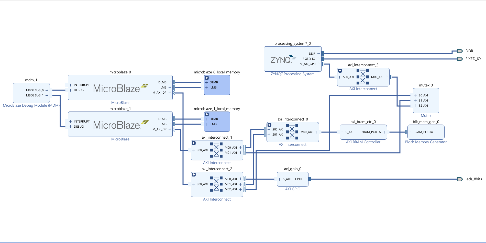

# FlashCore

***

## Multi core Microblaze with Mutex IP core

This experiment was conducted in order to apply benchmarking using multi-microblaze structure and see acceleration outputs. There are three source files added in the experiment. MonteCarlo_single_core file designed for testing Monte Carlo Pi algorithm in one microblaze core. The remaining files are designed to test the proposed algorithm in Multi-Microblaze design.

### Step-by-step Build Instructions

1. Construct the below hardware design

2. Synthesize the design and export hardware

3. Choose create new application project and choose target hardware

4. Choose processor option accordingly

5. Select proper board support package and create empty application

6. Import the given source files according to the selected processors

7. Repeat steps 3,4,5,6 for all source files

8. Right click on one of the projects and add run/debug configuration

9. Double click on system debugger and in the application tab, choose microblaze 0 for single core application or chose both microblaze cores for multicore application

10. In project name tab, choose the proper source file then click apply

11. Run/debug the projects

12. Results of the software can be seen with debugging the applications

