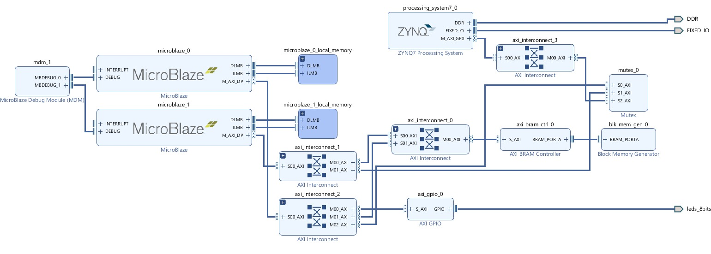

# FlashCore

FlashCore: Multi-Microblaze based System-on-Chip design and evaluate it with multi-threaded benchmarks

Team Number: xohw22-112

This project was carried out within the scope of the EEM464 course at the Department of Electrical and Electronics Engineering at Eskişehir Technical University.
The experiments were conducted on Zedboard Zynq Evaluation and Development Kit.
Software version is Xilinx Vivado 2018.3

***

## Abstract

Multiprocessor systems-on-chips (MPSoCs) have widely adopted in many different applications [1] 
and adaptive capabilities of a reconfigurable-computing and especially MPSoC-based reconfigurable
systems are promising [2] over the last past years. An MPSoC system consists of mainly many
processors/cores/CPUs and also different peripherals such as specialized digital hardware accelerators
and they aim especially to perform a given domain of tasks in parallel. By employing a multi-core
approach, a viable benefit is an acceleration of the selected specific task; but the drawback is the
programming such a multi-core system, especially in shared memory programming perspective.
Acceleration in terms of performance is needed, since a newer generation of technology node does not
provide the expected performance Today. By considering the chip design/manufacturing limitations
Today, we believe that application-specific software design and developments on an heterogeneous-
reconfigurable multi-core system could be a solution to increase performance of many systems.
MPSoCs utilize the thread-level parallelism [3] to achieve higher performance with a lack of
programming overhead. Some design challenges were addressed in an early premier study [4] : (1) a
need for real-time operation, (2) low-power consumption from hardware perspective, (3) a need for
developing environment-tool, (4) operating systems, and (5) embedded system security from software
perspective. In order to overcome the existing challenges, we will create a MicroBlaze-based soft-core
processor-based system-on-chip as a reconfigurable multi-core MPSoC. The MicroBlaze soft-core
processor is optimized and programmable intellectual property for applications runs on Xilinx FPGAs
and based on Reduced Instruction Set Computer (RISC) architecture. MicroBlaze can connect to not
only existing Processing System (PS) but also other modules exist in PS side through AXI interconnect.
Thus, mobility and reconfigurability can be achieved.
In this study, our main objective is to create a multi-processor system-on-chip (MPSoC) framework
using MicroBlaze-based soft-core processors. By studying this subject, a solution for inter-processor
synchronization problem in the hardware level is aimed to be proposed. Planned study for the research
includes running multi-threaded benchmarks, understanding the capabilities, limitations, working
principle of synchronization elements while experimenting the proposed MPSoC on FPGA. Using the
power acquired from the combination of soft-core and hard-core processors and reconfigurable
computing, an improvement in the performance in terms of acceleration and efficiency is aimed to be
achieved. There are some design challenges such as accessing memory elements efficiently. Memory
and organizing access to shared resources or scheduling infrastructure are key problems we want to
solve within MicroBlaze soft-core processors and task handling. Therefore, optimizing the memory
hierarchy and efficiency of the scheduling infrastructure are the parts of the project’s main objectives.
In conclusion, incorporating everything into our custom Microblaze-based MPSoC approach, complex
design process can be difficult, and our main motivation is to overcome this design process considering
every existing challenges.

***

### GitHub Link : https://github.com/DHLSan/FlashCore
### YouTube Link : https://youtu.be/WHOWx3jlIoo

# In Progress Work
When implementing a multi core solution, usually the current tasking is distributed among available cores in order to get the maximum performance out of each core. As a requirement to this operation, processors must communicate and share system resources safely and reliably. Inter processor communication, helps to conduct this process without causing conflict. Using mailboxes and mutexes is an efficient way of using system resources reliably. Therefore in the design prosess of the project, 
mailbox and mutex IP cores was used. The hardware design is given in image below.

***

# Results
In order to see the acceleration with applying benchmarking, Monte Carlo Pi estimation algorithm was developed and applied for both the single core of MicroBlaze and multi core MicroBlaze. Testing of the final progress of the project can be made by running experiment 3. The results of the conducted work can be found in project progress report.

***

## **_Participants_** ##
- Zeynep Bilge
  - Contact: zeynepbilge@eskisehir.edu.tr
- Berkehan Altın
  - Contact: berkehanaltin@eskisehir.edu.tr
  
## **_Supervisor_** ##
 - Ismail San
    - Contact: isan@eskisehir.edu.tr

## References

[1] Janac, K. C. (2021). Network‐on‐Chip (NoC): The Technology that Enabled Multi‐processor
Systems‐on‐Chip (MPSoCs). Multi‐Processor System‐on‐Chip 1: Architectures, 195-225.

[2] Lemonnier, F., Millet, P., Almeida, G. M., Hübner, M., Becker, J., Pillement, S., ... & Lemaire, R.
(2012, July). Towards future adaptive multiprocessor systems-on-chip: An innovative approach for
flexible architectures. In 2012 International Conference on Embedded Computer Systems (SAMOS) (pp.
228-235). IEEE.

[3] Acharya, G. P., & Rani, M. A. (2018). FPGA Prototyping of Micro-Blaze soft processor based Multi-
core System on Chip. International Journal of Engineering & Technology, 7(2.16), 57-60.

[4] Wolf, W. (2004, July). The future of multiprocessor systems-on-chips. In Proceedings. 41st Design
Automation Conference, 2004. (pp. 681-685). IEEE.
